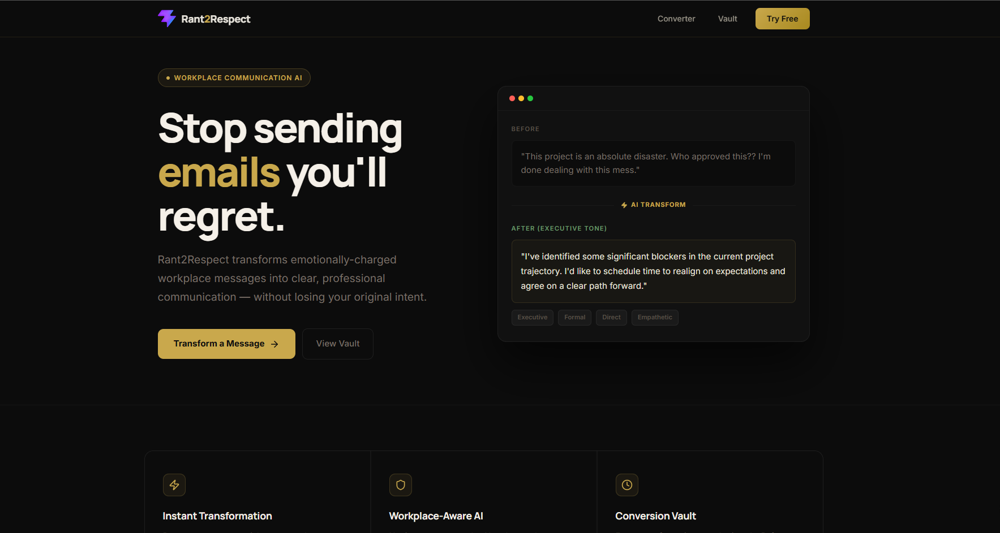

<div align="center">

# ⚡ Rant2Respect

### *From Rant to Respect — AI-Powered Workplace Communication*

[](https://rant2-respect21.vercel.app)
[](https://github.com/ParmS-Musale/Rant2Respect)
[](https://github.com/ParmS-Musale/Rant2Respect)
[](LICENSE)

<br/>

> **Stop sending emails you'll regret.**
>
> Rant2Respect transforms emotionally-charged workplace messages into clear, professional communication — without losing your original intent.

<br/>

[🚀 Try Live Demo](https://rant2-respect21.vercel.app) · [📦 Install Extension](#-chrome-extension) · [🛠️ Run Locally](#-getting-started) · [📖 Documentation](#-how-it-works)

</div>

---

## 📌 The Problem

We've all been there — a frustrating email, an annoying Slack message, or a meeting that went south. You type an angry response, hover over "Send"... and then either:

- 🔥 **Send it** → regret it for weeks
- 🗑️ **Delete it** → feel unsatisfied

**Rant2Respect** gives you a third option: **transform it** into something professional, respectful, and effective — in under 2 seconds.

---

## ✨ Key Features

### 🎯 Message Converter (Dashboard)
| Feature | Description |
|---------|-------------|
| **Multi-Tone AI** | Choose from **4 professional tones** — Formal, Executive, Direct, Empathetic |
| **Instant Transform** | Paste your rant, pick a tone, get polished output in under 2 seconds |
| **Respect Meter** | Visual progress bar showing the transformation status |
| **One-Click Copy** | Copy the refined message to clipboard instantly |
| **Smart Placeholders** | Contextual examples guide you on what to write |

### 🏦 Conversion Vault
| Feature | Description |
|---------|-------------|
| **Auto-Save History** | Every transformation saved privately for future reference |
| **Search Archive** | Full-text search across all past rants and results |
| **Tone Badges** | Visual tone indicators for each saved conversion |
| **Timestamped** | Know exactly when each transformation happened |
| **Quick Copy** | Re-copy any past result with a single click |

### 🧩 Chrome Extension (v1.0.2)
| Feature | Description |
|---------|-------------|
| **Gmail Integration** | Injected R2R button appears inside Gmail compose windows |
| **LinkedIn Integration** | Works inside LinkedIn messaging too |
| **In-Context Modal** | Beautiful dark modal overlays with draft preview + refined output |
| **Insert to Email** | Apply transformed text directly back into the compose field |
| **Icon-Only Button** | Compact, non-intrusive floating icon in the bottom-left corner |

---

## 🖼️ Screenshots

<div align="center">

### 🏠 Landing Page — Hero + Before/After Demo



> Premium dark UI with before/after demo card, hero section, feature grid, and gold accent design system

</div>

---

## 🛠️ Tech Stack

<div align="center">

| Layer | Technology |
|-------|-----------|
| **Frontend Framework** | React 19 + Vite 8 |
| **Routing** | React Router DOM v7 (HashRouter) |
| **Styling** | Tailwind CSS v4 + Custom CSS |
| **Typography** | Google Fonts (Inter, Manrope) |
| **Icons** | Lucide React |
| **AI Engine** | Google Generative AI (Gemini) |
| **Chrome Extension** | Manifest V3 |
| **Deployment** | Vercel |

</div>

---

## 🏗️ Project Architecture

```
Rant2Respect/
├── public/                     # Chrome Extension assets
│   ├── manifest.json           # Manifest V3 config
│   ├── content.js              # Content script (Gmail/LinkedIn injection)
│   ├── content.css             # Injected button & modal styles
│   ├── logo.png                # Extension icon (16/32/48/128px)
│   ├── favicon.svg             # Web app favicon
│   └── icons.svg               # Additional icon assets
│
├── src/
│   ├── main.jsx                # React entry point
│   ├── App.jsx                 # Root component with HashRouter
│   ├── App.css                 # Global utility styles
│   ├── index.css               # Tailwind + base reset
│   │
│   ├── components/
│   │   └── Header.jsx          # Fixed navbar with mobile hamburger menu
│   │
│   ├── pages/
│   │   ├── LandingPage.jsx     # Hero + Features + CTA sections
│   │   ├── Dashboard.jsx       # Message converter with tone selector
│   │   └── Vault.jsx           # Searchable conversion history
│   │
│   └── extension/              # Extension source files (dev)
│       ├── content.js
│       └── content.css
│
├── dist/                       # Production build (load as Chrome extension)
├── index.html                  # HTML entry
├── vite.config.js              # Vite config with Tailwind plugin
├── package.json                # Dependencies & scripts
├── .env                        # API keys (not committed)
└── .gitignore
```

---

## 🚀 Getting Started

### Prerequisites

- **Node.js** >= 18.x
- **npm** >= 9.x
- **Google Chrome** (for extension testing)

### Installation

```bash
# 1. Clone the repository
git clone https://github.com/ParmS-Musale/Rant2Respect.git
cd Rant2Respect

# 2. Install dependencies
npm install

# 3. Create environment file
echo "VITE_GEMINI_API_KEY=your_gemini_api_key_here" > .env

# 4. Start development server
npm run dev
```

The app will be live at `http://localhost:5173`

### Build for Production

```bash
npm run build
```

Output goes to the `dist/` folder.

---

## 🧩 Chrome Extension

### Installation (Developer Mode)

1. **Build the project:**
   ```bash
   npm run build
   ```

2. **Open Chrome Extensions:**
   - Navigate to `chrome://extensions/`
   - Enable **Developer Mode** (top-right toggle)

3. **Load the extension:**
   - Click **"Load unpacked"**
   - Select the `dist/` folder from the project

4. **Start using:**
   - Open **Gmail** (`mail.google.com`) or **LinkedIn** (`linkedin.com`)
   - Click on any compose/message box
   - Look for the ⚡ **R2R icon** in the bottom-left corner
   - Click it → see the transformation modal → insert into your message

### How the Extension Works

```
Gmail / LinkedIn
    └── Content Script injects R2R button
          └── User clicks icon
                └── Modal opens with draft content
                      └── AI transforms the message
                            └── User clicks "Insert Into Email"
                                  └── Transformed text replaces original
```

### Supported Platforms

| Platform | Status | Injection Point |
|----------|--------|----------------|
| Gmail | ✅ Live | Compose window (contenteditable areas) |
| LinkedIn | ✅ Live | Message box (contenteditable areas) |
| Outlook Web | 🔜 Coming Soon | — |
| Slack Web | 🔜 Coming Soon | — |

---

## 🎨 Design System

Rant2Respect uses a **premium dark theme** with a gold accent palette:

| Token | Value | Usage |
|-------|-------|-------|
| `--bg-primary` | `#0C0C0C` | Main background |
| `--bg-card` | `#111111` | Card surfaces |
| `--text-primary` | `#F5F0E8` | Headings, primary text |
| `--text-body` | `#E8E4DC` | Body text |
| `--text-muted` | `#7A7068` | Secondary text |
| `--text-dim` | `#5A5248` | Labels, captions |
| `--accent-gold` | `#C9A84C` | Primary accent, CTAs |
| `--accent-gold-dark` | `#A8891F` | Gradient end, hover |
| `--success` | `#8BCA8B` | Success states |
| `--border-subtle` | `rgba(255,255,255,0.06)` | Card borders |

### Typography
- **Headings:** Manrope (700, 800)
- **Body:** Inter (400, 500, 600, 700)

---

## 🔄 How It Works

```
┌─────────────────────────────────────────────────┐
│                  USER INPUT                      │
│  "This project is a disaster. Who approved this? │
│   I'm done dealing with this mess."              │
└──────────────────────┬──────────────────────────┘
                       │
                       ▼
         ┌─────────────────────────┐
         │     TONE SELECTION      │
         │  ┌───────┐ ┌─────────┐  │
         │  │Formal │ │Executive│  │
         │  └───────┘ └─────────┘  │
         │  ┌──────┐  ┌──────────┐ │
         │  │Direct│  │Empathetic│ │
         │  └──────┘  └──────────┘ │
         └────────────┬────────────┘
                      │
                      ▼
         ┌─────────────────────────┐
         │    AI TRANSFORMATION    │
         │  Google Gemini Engine   │
         │  Context-aware rewrite  │
         └────────────┬────────────┘
                      │
                      ▼
┌─────────────────────────────────────────────────┐
│               PROFESSIONAL OUTPUT                │
│  "I've identified some significant blockers in   │
│   the current project trajectory. I'd like to    │
│   schedule time to realign on expectations and   │
│   agree on a clear path forward."                │
└─────────────────────────────────────────────────┘
```

### Tone Guide

| Tone | Best For | Style |
|------|----------|-------|
| 🎩 **Formal** | Clients, Senior Managers | Polished, structured, respectful |
| 👔 **Executive** | C-Suite, Board Reports | Strategic, concise, authoritative |
| 🎯 **Direct** | Peers, Team Feedback | Clear, no-nonsense, actionable |
| 💚 **Empathetic** | Conflict, HR Situations | Understanding, collaborative, warm |

---

## 📱 Responsive Design

| Breakpoint | Behavior |
|------------|----------|
| **Desktop** (>=900px) | Two-column hero layout, side-by-side converter panes |
| **Tablet** (768px-899px) | Stacked hero, dual converter panes |
| **Mobile** (< 640px) | Single column, hamburger nav, stacked UI |

---

## 🔑 Environment Variables

| Variable | Required | Description |
|----------|----------|-------------|
| `VITE_GEMINI_API_KEY` | Yes | Google Generative AI (Gemini) API Key |

Get your free API key at [Google AI Studio](https://aistudio.google.com/apikey).

---

## 📦 Available Scripts

| Command | Description |
|---------|-------------|
| `npm run dev` | Start Vite dev server on localhost:5173 |
| `npm run build` | Production build to dist/ |
| `npm run preview` | Preview production build locally |
| `npm run lint` | Run ESLint for code quality |

---

## 🚢 Deployment

### Vercel (Recommended)

1. Push your code to GitHub
2. Import the repo on [vercel.com](https://vercel.com)
3. Set environment variable: `VITE_GEMINI_API_KEY`
4. Deploy — zero config needed!

**Live URL:** [https://rant2-respect21.vercel.app](https://rant2-respect21.vercel.app)

### Chrome Web Store (Extension)

1. Run `npm run build`
2. Zip the `dist/` folder
3. Submit to [Chrome Web Store Developer Dashboard](https://chrome.google.com/webstore/devconsole)

---

## 🗺️ Roadmap

- [x] Core message transformation with 4 tones
- [x] Conversion Vault with search
- [x] Chrome Extension for Gmail & LinkedIn
- [x] Premium dark theme with gold accents
- [x] Responsive design for all devices
- [x] Vercel deployment
- [ ] Gemini API live integration (full pipeline)
- [ ] Outlook Web support
- [ ] Slack Web support
- [ ] Conversation thread analysis
- [ ] Team sharing & collaboration
- [ ] Chrome Web Store publishing
- [ ] Context-aware suggestions based on email thread

---

## 🤝 Contributing

Contributions are welcome! Here's how to get started:

```bash
# Fork the repo
git fork https://github.com/ParmS-Musale/Rant2Respect.git

# Create a feature branch
git checkout -b feature/amazing-feature

# Make your changes and commit
git commit -m "feat: add amazing feature"

# Push and create a PR
git push origin feature/amazing-feature
```

### Contribution Guidelines
- Follow existing code style and component patterns
- Use inline styles consistent with the existing design system
- Test on both web and Chrome extension contexts
- Keep PRs focused and well-described

---

## 📄 License

This project is licensed under the **MIT License** — see the [LICENSE](LICENSE) file for details.

---

## 👤 Author

**Parm S. Musale**

[](https://github.com/ParmS-Musale)

---

<div align="center">

### ⚡ Don't send another angry email. Transform it.

[](https://rant2-respect21.vercel.app)

<br/>

**Built with 🔥 frustration and ✨ professionalism**

<sub>If this project helped you, please ⭐ the repo!</sub>

</div>
